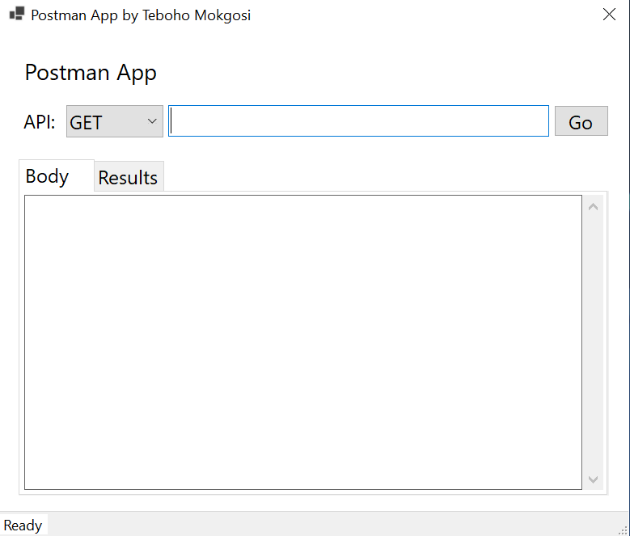

# PostmanApp

This is a solution of the Postman App in Windows forms. This Postman app provides a user-friendly interface for making GET requests to APIs and viewing the responses in formatted JSON. It is ideal for developers and testers, this tool simplifies API interaction and debugging, helping you efficiently validate and troubleshoot your API calls. 

## Process - Using the App
1. Download the executable file from the release section
2. When the application launches it should look like this:   
3. Fill in your API URL and press 'Go'. It should look like this for every action(GET, POST, PUT, PATCH and DELETE) example shows screen for PATCH, other screenshots are in the Images folder: 
4. The app will then display results and it should look like this: 

## Built with/Technologies used
* C#
* .NET 8
* WinForms
* HttpClient
